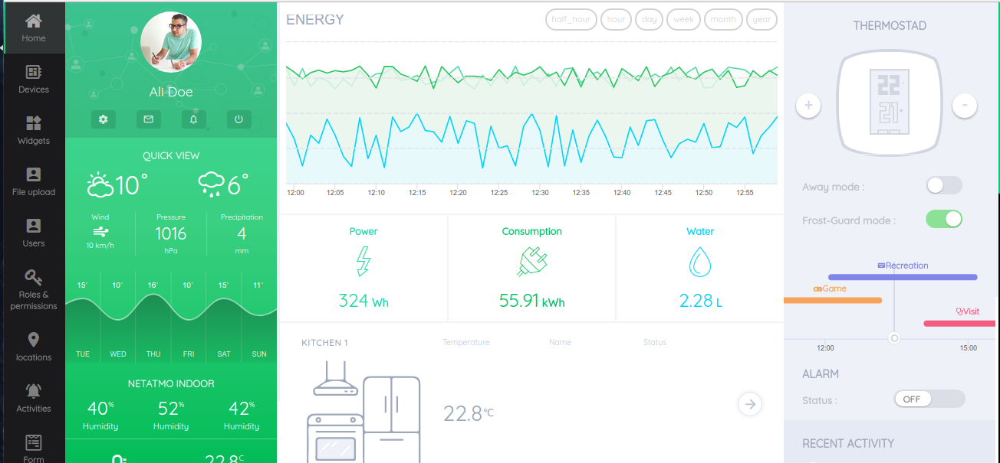

# Smart angular dashboard ( Angular Iot Dashboard )
IoT (Internet of Things) specific dashboard based on Angular 4. Many reusable components, you can inspire and implement your own version of hosted iot dashboard using Angular IoT dashboard. A real-time compatible dashboard for any browser.
The goal of this repository is to be a resilience front-end for smart homes, smart offices, and industrial automation. 
**This project is heavily under development; In case you need to use some components in production level, please contact the owners**

# Features
This project has a decoupled data layer and view layer. 
The logic behind this app is connecting your physical devices to cloud, and make widgets based on their IO, and distribute between your locations.
We are covering user/role control access, and tracking activities. Since project is heavily under development, we are in doubt of our 
first stable version features yet.

## Technical stack

* Project is based on Angular 4 and angular CLI. For developing, we've added `npm run hmr` to provide hot reloading, but for production level we use `npm run production`, which calls `ng *` tasks directly.
* We are using highcharts library for our charts. For any incoming pull requests that containing other chart libraries, please open an issue first and describe why it's not possible to do it using highcharts.
**We have removed highchart from this library, because it's included in `ng-iot` project. Probably we will remove that as well and use a npm package for this purpose**
* Lodash, and NgRx store are used heavily for data flow.
* Async/Await concepts are everywhere since project is a realtime dashboard
* Our TDD is karma ( default of the angular CLI ) and for CI, we use `TravisCI`. If you want to host the project on a private repository, you might want to 
write your CI specific configuration. We will cover CircleCI build in a near future.
* This project will produce only static files, project demo is hosted on the `Google firebase` but you can host the `dist` folder anywhere you want.
* We have a specific data flow, for catching data from server and posting back the user actions. Document for them currently missing, but you might check `requests.service` and `actions.service`
for this purpose.

## Live preview

You can see the latest deploy here: [https://owsolutions.github.io/angular5-iot-dashboard](https://owsolutions.github.io/angular5-iot-dashboard)

We are hosting demo version on github. For enterprise version, please contact us.

## Contribution guide
We are so much excited to receive Pull-Requests from you. There are some simple rules that we follow in our project:

* Please no comments on functions unless it's really necessary. Please refer to this article for reason: https://bradt.ca/blog/useless-code-comments/
* Open an issue for your pull request, and start your branch name with this format: `issue/[number]-this-is-my-branch` so we can track the issue until we close it.
* Make sure your code passes tests, linting and e2e tests. For new functionality, please add abundant tests.

## Copywrite
This project is free for educational usage, code review and non-commercial usage. For enterprise/commercial usage, you need to obtain a license. 

# Credits

Icons made by <a href="http://www.flaticon.com/authors/madebyoliver" title="Madebyoliver">Madebyoliver</a> from <a href="http://www.flaticon.com" title="Flaticon">www.flaticon.com</a> is licensed by <a href="http://creativecommons.org/licenses/by/3.0/" title="Creative Commons BY 3.0" target="_blank">CC 3.0 BY</a>

